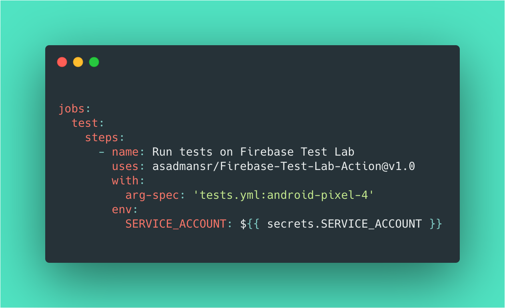

# Firebase Test Lab GitHub Action

[](https://github.com/asadmansr/Firebase-Test-Lab-Action/releases)
[](https://github.com/marketplace/actions/firebase-test-lab-action)

A GitHub Action to test mobile applications (Android, iOS) using Firebase Test Lab.

<br>



<br>

Inspired by the 2020 [GitHub Actions Hackathon.](https://github.community/t5/Events/Featured-Event-GitHub-Actions-Hackathon/td-p/48206)

<br>

## Introduction

Testing mobile applications can be a challenge. With Firebase Test Lab, testing becomes much easier whether it's validating new changes on a continuous integration (CI) pipeline or tracking down bugs on specific devices. This GitHub Action automates the setup of the gcloud command line tool and provides an easy interface to start testing quickly.

<br>

## Pre-requisites

1. `Service Account`: A service account is a special kind of account with specific permissions to authenticate with the Cloud Platform when used on a virtual machine for continuous integration.

2. `ARG SPEC File`: A YAML argument file that lists out all of the configurations for Firebase Test Lab. In this file, you can specify the test APK, filter the tests, select virtual or physical devices and indicate the type of test to perform.


<br>

## Usage
workflows/main.yml:
```
name: Android CI
on: [push]

jobs:
  test:
    runs-on: ubuntu-latest
    steps:
      # Check out the repository
      - uses: actions/checkout@v2

      # Run the Firebase Test Lab Action
      - name: Run tests on Firebase Test Lab
        uses: asadmansr/Firebase-Test-Lab-Action@v1.0
        with:
          arg-spec: 'tests.yml:android-pixel-4'
        env:
          SERVICE_ACCOUNT: ${{ secrets.SERVICE_ACCOUNT }}
```

tests.yml:
```
android-pixel-4:
  type: instrumentation
  app: app-debug.apk
  test: app-debug-test.apk
  device:
    - model: flame
      version: 29
      locale: 'en'
      orientation: portrait
```

<br>

The following usage comes with additional instructions regarding the input and environment variables that can be found in the [Simple Usage Documentation](/docs/SIMPLE_USAGE.md).

Currently, this GitHub Action only runs Android tests. Support for iOS coming soon.

<br>

## Inputs

#### `arg-spec`

YAML file that contains configuration for Firebase Test Lab. Format must be ARG_FILE:ARG_GROUP_NAME. **Required**

#### `SERVICE_ACCOUNT`

Copy-paste the content of the JSON-formatted service account file in GitHub's secret variables in settings. **Required**

<br>

## Contributing

Are you facing an issue? Have some questions? Would like to implement a new feature? Learn more about our [contributing guidelines](CONTRIBUTING.md).

<br>

## Licence

The project is released under the [MIT License](LICENSE).